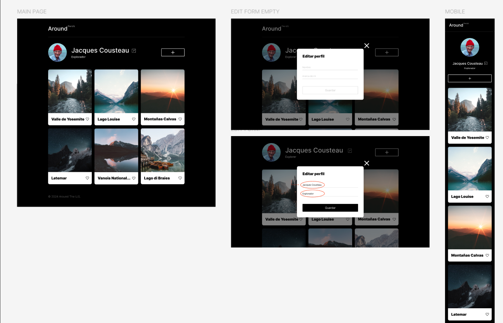
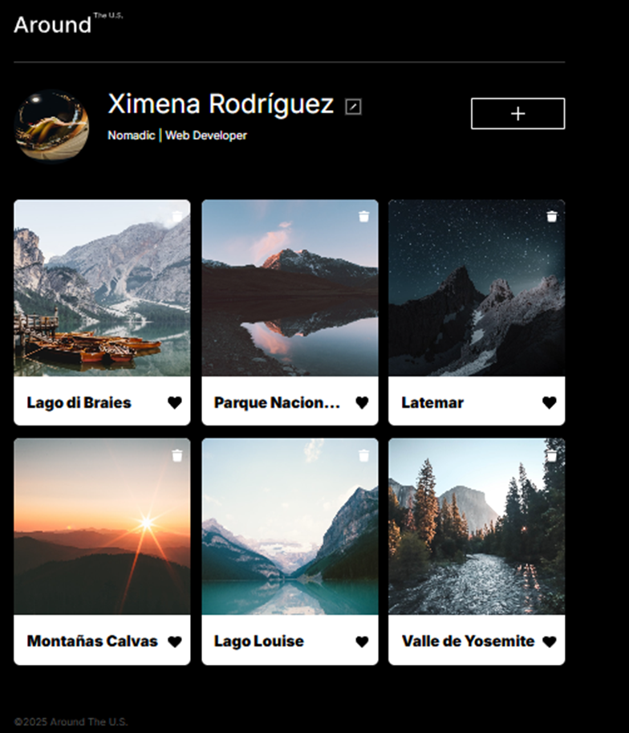
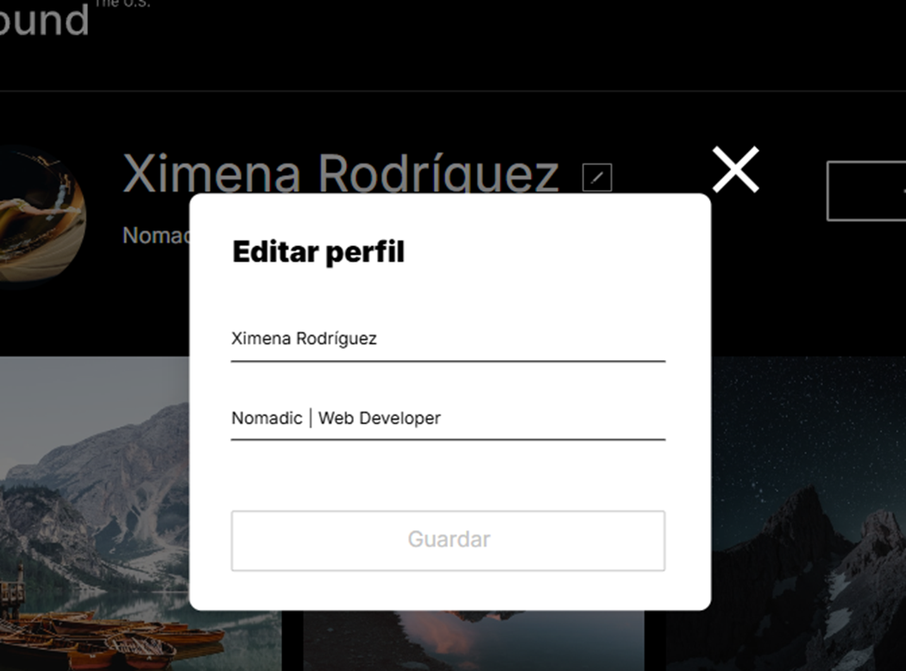

# Tripleten Proyecto: web_project_around

# Descripción

Este proyecto es una aplicación web interactiva similar a Instagram, que permite a los usuarios personalizar su perfil, cambiar su foto de perfil, añadir, eliminar y dar "me gusta" a imágenes.
La interfaz fue realizada siguiendo un diseño en Figma y posteriormente desarrollada con funcionalidad completa. Se han validado los formularios para agregar tarjetas y modificar el perfil, asegurando una experiencia fluida y segura.
La aplicación ha sido construida bajo los principios de Programación Orientada a Objetos (POO), incorporando interactividad avanzada y conectándose con una API para el almacenamiento y gestión de datos en tiempo real. Actualmente, está implementada en JavaScript Vanilla, y el próximo paso en su evolución es refactorizarla para React, con el fin de optimizar su rendimiento y escalabilidad

# Primera Parte:

# Diseño de Figma

# Funcionalidad:

- Diseño responsivo
- Se ha implementado un cuadro emergente "Editar perfil", que aparece cuando el usuario hace clic en el botón "Editar". Para cerrar el cuadro, el usuario puede hacer clic en el botón de cierre ubicado en la esquina superior derecha. Este mecanismo garantiza una experiencia intuitiva y fluida al gestionar la edición del perfil.
- El cuadro emergente "Editar perfil" permite modificar el nombre y la ocupación del usuario. Al realizar los cambios y confirmar la edición, la información actualizada se refleja automáticamente en la página, garantizando una experiencia fluida e interactiva. Este mecanismo optimiza la gestión del perfil, permitiendo una personalización sencilla y eficaz

# Resultado de diseño según Figma

# Imagen del cuadro emergente "Editar perfil"

Fue creado utilizando HTML, CSS y JavaScript, con base en un diseño en Figma.

Características del proyecto:
HTML5 semántico
Metodología BEM
Diseño responsivo
JavaScript
Refactorización con POO

Link:https://ximerm.github.io/web_project_around/
